# IPFS Web3 Authed Fateway Performance Report

## Intro

This report includes the performance metrics of upload (store) and download (retrieve) processes with the following listed services:

1. IPFS Web3 Authed gateway
2. Pinata gateway
3. Tencent COS(Centralized Cloud Server)
4. [Download] IPFS command line(IPFS protocol)

## Testing Process

- In the upload process, files are uploaded from 2 different test machines to the listed services via HTTP/HTTPS.
- In the download process, files are downloaded from the listed services to 2 different test machines via HTTP/HTTPS/IPFS.

## Testing Params

1. Test machines

|Testing Machine|Environment|
|---------------|-----------|
|Host-1         |Tencent COS (Shanghai)|
|Host-2         |Tencent COS (Singapore)|

2. Test files

|File Name|File Size|
|---------|---------|
|1M-1     |1MB      |
|1M-2     |1MB      |
|1M-3     |1MB      |
|200M-1   |200MB    |
|200M-2   |200MB    |
|200M-3   |200MB    |
|500M-1   |500MB    |
|500M-2   |500MB    |
|500M-3   |500MB    |

*Note that: IPFS Web3 Authed gateway uses IPFS Thunder gateway in China, all the testing data produced with thunder gateway.

## Detailed testing process

### 1. [Upload] 1M file

 **Host 1 → IPFS Thunder Gateway**

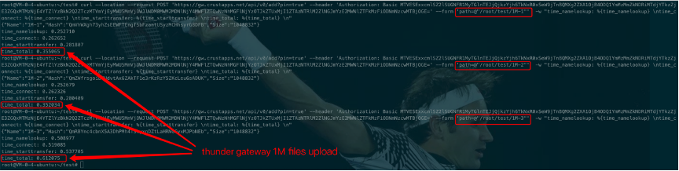

**Host 1 → Pinata**

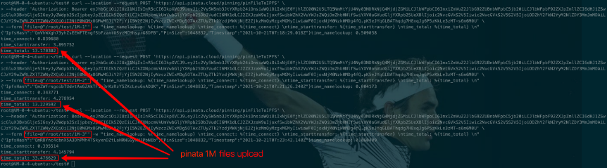

**Host 1 →Tencent COS**

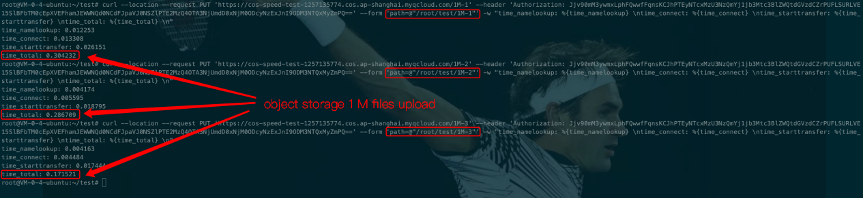

### 2. [Upload] 200MB file

**Host 1 → IPFS Thunder Gateway**

**Host 1 → Pinata**

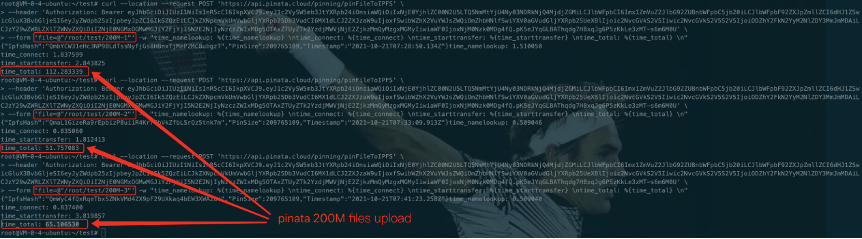

**Host 1 →Tencent COS**

### 3. [Upload] 500MB file

**Host 1 → IPFS Thunder Gateway**

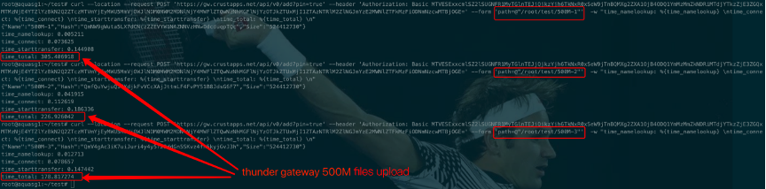

**Host 1 → Pinata**

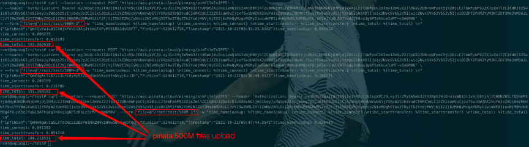

**Host 1 →Tencent COS**

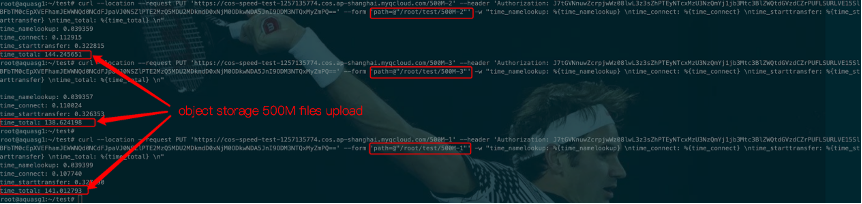

> Host 2(Singapore) also tested like above
> 

### 4. [Download] 1MB file

**IPFS Thunder Gateway → Host 1**

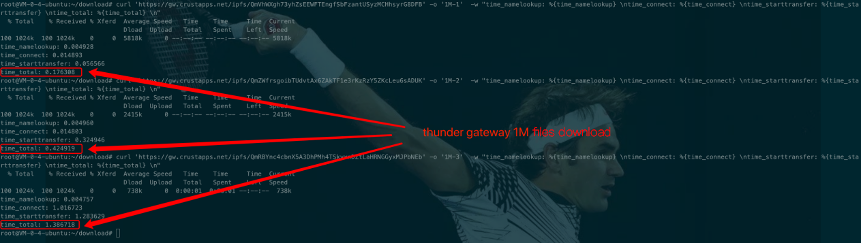

**Pinata → Host 1**

**Tencent COS → Host 1**

**IPFS Command on Host 1**

### 5. [Download] 200MB file

**IPFS Thunder Gateway → Host 1**

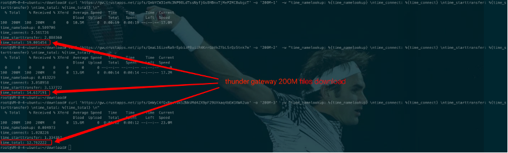

**Pinata → Host 1**

**Tencent COS → Host 1**

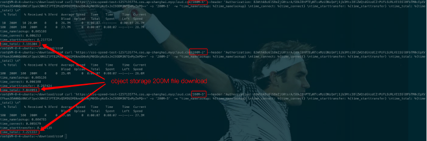

**IPFS Command on Host 1**

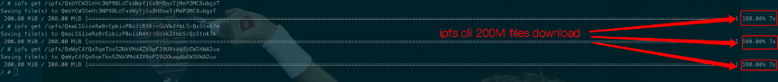

### 6. [Download] 500MB file

**IPFS Thunder Gateway → Host 1**

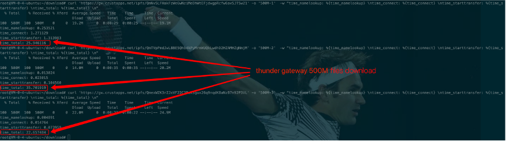

**Pinata → Host 1**

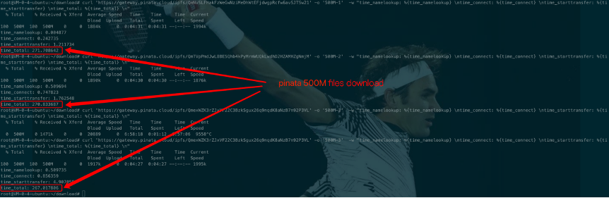

**Tencent COS → Host 1**

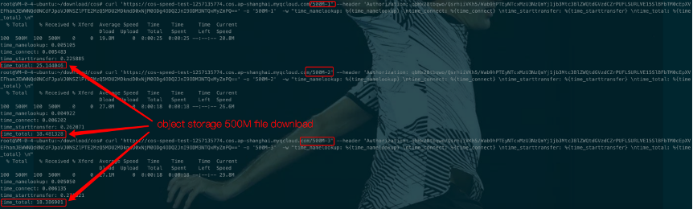

**IPFS Command on Host 1**

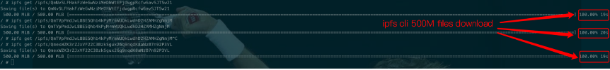

> Host 2(Singapore) also tested like above
> 

# Summary

## Upload Metrics (in seconds)

## Download Metrics (in seconds)

